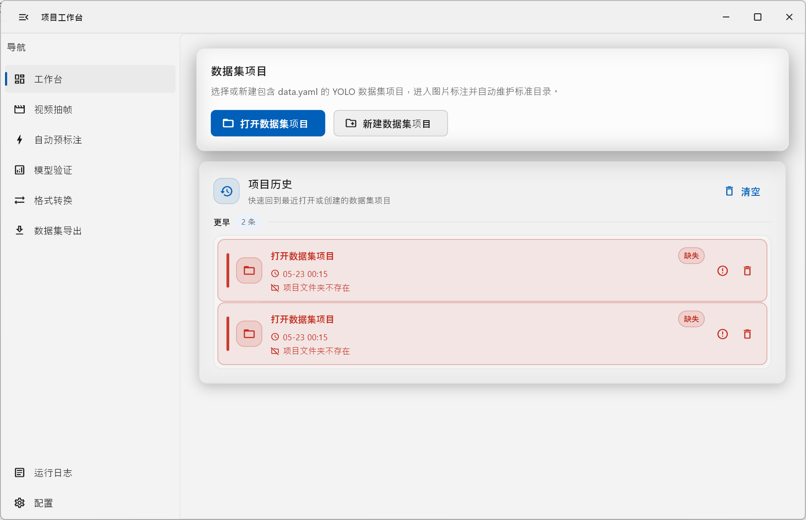

# flutter_label

`flutter_label` 是一个面向 YOLO 目标检测数据集的 Flutter 桌面标注工具。当前代码主要覆盖 Windows
桌面端，提供数据集项目管理、图片标注、视频抽帧、自动预标注、模型验证、格式转换、数据集导出、运行日志和应用配置等能力。

项目的模型推理与视频抽帧能力通过 Dart FFI 调用 C++ 动态库 `native_core` 完成；`native_core` 负责链接 ONNX
Runtime、FFmpeg，并在 Windows 上提供窗口选择与窗口画面捕获能力。

## 项目预览



## 主要功能

- 数据集项目管理：新建或打开标准 YOLO 数据集项目，维护 `data.yaml` 和内部缓存 `project.json`。
- 图片导入与索引：支持导入图片文件或目录，并按 `train`、`val`、`test` split 放入 `images/` 和 `labels/` 标准目录。
- 图片标注：读取和保存 YOLO txt 标签，支持类别面板、图片列表、标注框列表、画布绘制和标注状态检查。
- 视频抽帧：通过 `native_core` + FFmpeg 按 FPS 或固定帧间隔抽帧，支持停止任务和输出冲突处理。
- 自动预标注：加载 YOLO ONNX 模型批量推理图片，生成或合并 YOLO 标签，并同步类别元信息。
- 模型验证：支持单图验证，以及 Windows 窗口实时验证。
- 格式转换：支持 YOLO、COCO、VOC 之间的部分转换路径。
- 数据集导出：整理项目为可用于 Ultralytics YOLO 训练的数据集，可按比例拆分并可生成 ZIP。
- 运行日志与历史记录：使用 Drift/SQLite 持久化最近历史、运行日志和图片索引。
- 应用配置：当前包含“空格完成并切换到下一张”等本机配置项。

## 技术栈

- Flutter / Dart：应用 UI 和业务编排，Dart SDK 约束为 `>=3.11.1 <4.0.0`。
- GetX：路由、依赖注入和状态管理。
- Drift + sqlite3_flutter_libs：本地 SQLite 数据库。
- file_picker：选择文件和目录。
- ffi：调用 `native_core` 动态库。
- toastification：全局提示。
- C++17 / CMake：构建 `native_core`。
- ONNX Runtime 1.26.0：YOLO ONNX 模型推理，通过本地脚本下载 Windows x64 GPU SDK。
- FFmpeg SDK：视频解码和抽帧，通过本地脚本生成 Windows x64 SDK。
- Windows API / DWM / WIC：窗口选择、窗口捕获和图像处理相关原生能力。

## 目录结构

```text
flutter_label/
├─ lib/
│  ├─ main.dart                         # 应用入口，初始化 MediaKit、数据库、日志和 GetX 路由
│  └─ app/
│     ├─ bindings/                      # GetX 页面绑定
│     ├─ controllers/                   # 页面控制器
│     ├─ database/                      # Drift 数据库、表和类型定义
│     ├─ models/                        # 项目配置、标注框、导出配置、推理结果等模型
│     ├─ pages/                         # 首页、标注、抽帧、预标注、验证、转换、导出等页面
│     ├─ routes/                        # GetX 路由表
│     ├─ services/                      # 文件、数据集、推理、抽帧、导出、设置等业务服务
│     ├─ utils/                         # 图片尺寸读取、坐标转换等工具
│     └─ widgets/                       # 标注画布、列表面板、检测预览等复用组件
├─ native/
│  ├─ CMakeLists.txt                    # native_core 构建配置
│  ├─ include/native_core.h             # Dart FFI 调用的 C ABI
│  ├─ src/                              # FFmpeg 抽帧、ONNX 推理、窗口捕获实现
│  └─ third_party/                       # 本地第三方 SDK，已被 Git 忽略
├─ windows/                             # Flutter Windows runner 和打包安装规则
├─ test/                                # 控制器、服务、页面、数据库和工具测试
├─ pubspec.yaml                         # Dart/Flutter 依赖
└─ analysis_options.yaml                # flutter_lints 配置
```

当前未发现 `android/`、`ios/`、`macos/`、`linux/`、`web/` 平台目录；项目实际能力以 Windows 桌面端为主。

## 环境要求

- Flutter SDK：需支持 Dart `>=3.11.1 <4.0.0`。
- Windows 桌面开发环境：需要启用 Flutter Windows desktop 支持。
- Visual Studio C++ 工具链：用于构建 Windows runner 和 C++ `native_core`。
- CMake：Windows runner 与 `native_core` 构建使用。
- NVIDIA GPU 推理可选：如果要使用 CUDA Provider，需要满足下文“Windows GPU 推理”的 CUDA/cuDNN DLL 要求。

## 依赖安装

原生第三方 SDK 不提交到 Git。首次构建 Windows 原生能力前，先在 WSL / Linux / Git Bash 中准备本地 SDK：

```bash
bash scripts/setup_native_deps.sh
```

脚本会把 ONNX Runtime 下载到 `native/third_party/onnxruntime`，并用 mingw-w64 从 FFmpeg 源码生成
`native/third_party/ffmpeg/{include,lib,bin}`。如果本地 SDK 已存在，脚本默认跳过；需要强制重建时使用：

```bash
NATIVE_DEPS_FORCE=1 bash scripts/setup_native_deps.sh
```

如果只需要其中一项，可以使用 `SKIP_FFMPEG=1` 或 `SKIP_ONNXRUNTIME=1`。FFmpeg 构建依赖
`git`、`make`、`x86_64-w64-mingw32-gcc` 和 `x86_64-w64-mingw32-objdump`；ONNX Runtime 下载依赖
`curl` 和 `unzip`。

也可以单独运行 ONNX Runtime 拉取脚本：

```bash
bash native/third_party/onnxruntime/fetch_onnxruntime.sh
```

```bash
flutter pub get
```

如果修改了 Drift 表、数据库或生成代码相关内容，再运行：

```bash
dart run build_runner build --delete-conflicting-outputs
```

## 运行方式

开发运行：

```bash
flutter run -d windows
```

构建 Windows 应用：

```bash
flutter build windows
```

Windows 构建过程中，`windows/CMakeLists.txt` 会同时构建 `native_core`，并把 `native_core.dll`、FFmpeg DLL、ONNX Runtime DLL
以及可找到的 CUDA/cuDNN DLL 安装到 `flutter_label.exe` 同级的 `lib/` 目录。

## 数据集项目约定

项目服务会创建或读取下面的 YOLO 数据集结构：

```text
dataset/
├─ data.yaml
├─ project.json
├─ images/
│  ├─ train/
│  ├─ val/
│  └─ test/
└─ labels/
   ├─ train/
   ├─ val/
   └─ test/
```

- `data.yaml` 中的 `names` 是打开项目时读取类别的主要来源。
- 外部类别真源统一为 `data.yaml.names`，项目服务和自动预标注流程不会再生成旧类别文件。
- `project.json` 是应用内部缓存，主要保存项目路径、类别和已完成图片等状态；损坏时会尽量以 `data.yaml` 为准重建。
- 标签格式为 YOLO txt：每行 `class_id x_center y_center width height`，坐标为 0 到 1 的归一化值。

## 模型与原生推理说明

### native_core 接口

Dart 层通过 `ffi` 调用 `native_core` 暴露的 C ABI。主要接口定义在 `native/include/native_core.h`，包括：

- `init_model`：初始化 YOLO ONNX 模型。
- `detect_image` / `detect_image_with_class_count`：图片检测并返回 JSON 字符串。
- `detect_bgra_frame_with_class_count`：对窗口捕获得到的 BGRA 内存帧做检测。
- `detect_folder` / `detect_folder_with_class_count`：批量检测并写出 YOLO 标签。
- `extract_frames_by_fps_with_options` / `extract_frames_by_interval_with_options`：视频抽帧。
- `cancel_video_extract`：协作式取消正在运行的抽帧任务。
- `get_model_provider`：返回当前实际推理 Provider，例如 `cuda` 或 `cpu`。
- `get_window_under_cursor`、`capture_window_frame`、`flash_window_border`：Windows 窗口选择、捕获和高亮。

### 动态库查找

Dart 服务在 Windows 上优先查找 exe 同级目录：

```text
<flutter_label.exe 所在目录>/lib/native_core.dll
```

开发运行时还会回退查找：

```text
<当前工作目录>/runtime/lib/native_core.dll
<当前工作目录>/lib/native_core.dll
```

加载 `native_core.dll` 前，Dart 会把该 `lib/` 目录加入 Windows DLL 搜索路径。开发时如果遇到动态库加载失败，应优先检查运行目录的
`lib/` 中是否存在 `native_core.dll`、`onnxruntime.dll` 和 FFmpeg 相关 DLL。

### ONNX 模型限制

- 当前 Dart 层校验模型扩展名为 `.onnx`。
- `imgsz` 允许范围为 `32` 到 `4096`。
- `conf` 和 `iou` 允许范围为 `0` 到 `1`。
- `classCount` 用于辅助区分 YOLOv8/YOLOv5 输出布局；未提供类别数量时，部分输出结构解析可能不准确。
- 原生后端会优先尝试 CUDA Execution Provider；如果 CUDA 不可用，会尝试 CPU Session。CPU 也失败时，Dart 侧会返回 native
  错误，不会再调用 `yolo` 命令或 Python `ultralytics` 模块。

### FFmpeg 抽帧

视频抽帧不调用系统 `ffmpeg` 命令，而是通过 `native_core` 链接 FFmpeg SDK 完成。Windows 下运行
`scripts/setup_native_deps.sh` 后，
`native/third_party/ffmpeg/` 应包含：

```text
include/  # libavcodec、libavformat、libavutil、libswscale 头文件
lib/      # avcodec.lib、avformat.lib、avutil.lib、swscale.lib
bin/      # avcodec、avformat、avutil、swscale 运行时 DLL
```

如果 FFmpeg SDK 未被 CMake 找到，`native_core` 仍可构建，但抽帧接口会返回 `-5`。

## Windows GPU 推理

原生 YOLO 后端使用 ONNX Runtime 1.26.0。`scripts/setup_native_deps.sh` 默认下载的是 CUDA 12.x 版 GPU Provider，因此 Windows GPU 推理还需要 NVIDIA
CUDA 12.x 运行时 DLL 和 cuDNN 9.x DLL。

至少需要以下 DLL：

- `cublasLt64_12.dll`
- `cublas64_12.dll`
- `cudart64_12.dll`
- `cudnn64_9.dll`
- `cudnn_adv64_9.dll`
- `cudnn_cnn64_9.dll`
- `cudnn_graph64_9.dll`
- `cudnn_ops64_9.dll`

原生侧还会预检以下 CUDA/cuDNN/ONNX Runtime Provider 依赖，避免 Windows Loader 在缺少 DLL 时直接报 `Error 126`：

- `onnxruntime_providers_cuda.dll`
- `onnxruntime_providers_shared.dll`
- `cublasLt64_12.dll`
- `cublas64_12.dll`
- `cudart64_12.dll`
- `cudnn64_9.dll`
- `cudnn_adv64_9.dll`
- `cudnn_cnn64_9.dll`
- `cudnn_graph64_9.dll`
- `cudnn_ops64_9.dll`

Windows CMake 安装步骤会搜索以下位置，并把匹配的 DLL 复制到 `flutter_label.exe` 同级的 `lib/` 目录：

- `CUDA_PATH` / `CUDA_HOME` / `CUDNN_HOME`
- `FLUTTER_LABEL_CUDA_RUNTIME_DIR`
- `FLUTTER_LABEL_CUDNN_RUNTIME_DIR`
- `native/third_party/cuda/windows-x64/bin`
- `native/third_party/cudnn/windows-x64/bin`

`windows/CMakeLists.txt` 中还会尝试复制可选 DLL：

- `cufft64_11.dll`
- `curand64_10.dll`
- `nvrtc64_120_0.dll`
- `cudnn*64_9.dll`

`nvidia-smi` 只能证明 NVIDIA 驱动已安装。它显示的 CUDA 版本不代表 ONNX Runtime 所需的 CUDA 运行时 DLL 已安装，或已对应用可见。

如果 CUDA/cuDNN DLL 缺失，应用会跳过 CUDA Provider 并降级到 CPU 推理。后台任务日志会显示当前 Provider，例如
`native_core 推理 Provider：cuda。` 或 `native_core 推理 Provider：cpu。`。

## 常见问题与排错

### 加载 native_core 失败

检查 `native_core.dll` 是否位于 `flutter_label.exe` 同级的 `lib/` 目录，或开发运行时是否位于 `<当前工作目录>/runtime/lib/native_core.dll`
。同时检查 `onnxruntime.dll`、`avcodec-*.dll`、`avformat-*.dll`、`avutil-*.dll`、`swscale-*.dll` 是否位于同一个 `lib/` 目录并可被加载。

### 自动预标注或模型验证初始化失败

确认模型文件存在且扩展名为 `.onnx`，`imgsz`、`conf`、`iou`、类别数量配置在合法范围内。查看运行日志中的 native 错误码和
`native_core 推理 Provider` 信息。

### GPU 没有启用

确认 CUDA 12.x 和 cuDNN 9.x DLL 对应用可见。建议优先通过 `CUDA_PATH`、`CUDA_HOME`、`CUDNN_HOME`，或 CMake 变量
`FLUTTER_LABEL_CUDA_RUNTIME_DIR`、`FLUTTER_LABEL_CUDNN_RUNTIME_DIR` 指向 DLL 所在目录。若日志显示 Provider 为 `cpu`，说明
CUDA Provider 初始化失败或依赖预检未通过。

### 视频抽帧失败

抽帧必须依赖 `native_core` 和 FFmpeg DLL。错误码含义在 Dart 服务中有映射：`-1` 参数无效，`-2` 视频不存在，`-3` 输出目录创建失败，
`-4` FFmpeg 解码或编码失败，`-5` 未链接 FFmpeg，`-6` 用户停止抽帧。

### 打开数据集项目失败

打开已有项目时必须存在 `data.yaml`，且 `names` 字段需要是当前解析器支持的格式。项目会自动确保 `images/train`、`images/val`、
`images/test` 与对应 `labels/` 目录存在。

### 标签异常或图片被跳过

YOLO 标签每行必须有 5 个字段，类别编号不能越界，归一化坐标必须在 `0..1` 范围内，宽高不能为
0。导入和导出流程会跳过损坏图片、非图片文件或重复图片，并把原因写入日志。

## 开发注意事项

- 不要直接编辑生成文件，特别是 Drift 生成的 `database.g.dart`；如修改表结构，应运行 `build_runner` 重新生成。
- `native/third_party/` 只存放本地下载或生成的第三方 SDK，已被 `.gitignore` 忽略，不应提交到 GitHub。
- `native_core` 以 C ABI 暴露给 Dart FFI，修改函数签名时必须同步更新 Dart typedef、C++ 头文件和实现。
- 视频抽帧与模型推理均在 isolate 或后台流程中执行，避免阻塞 UI；同一模型推理任务通过 `NativeModelLock` 控制并发。
- Windows GPU 推理需要保证 ONNX Runtime Provider DLL 与 CUDA/cuDNN DLL 在应用 `lib/` 目录或系统搜索路径可见。
- `project.json` 是内部缓存，不应作为外部训练工具的配置来源；训练相关配置以导出的 `data.yaml` 和标准目录为准。
- 当前代码以 Windows 桌面端为主要目标；Linux/macOS 的动态库路径在 Dart 层有预留，但仓库中未发现对应平台工程目录和原生打包配置。

## 验证命令

常用静态分析：

```bash
flutter analyze
```

运行测试：

```bash
flutter test
```
